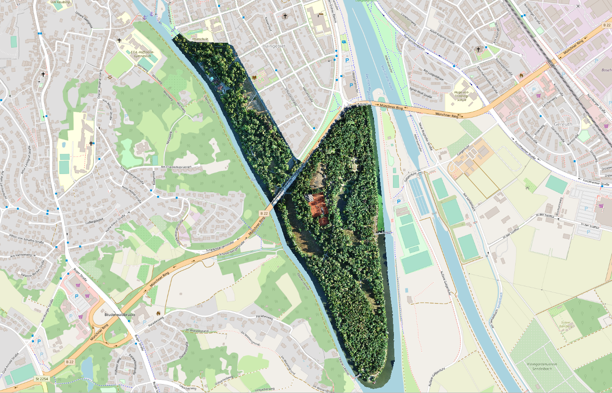
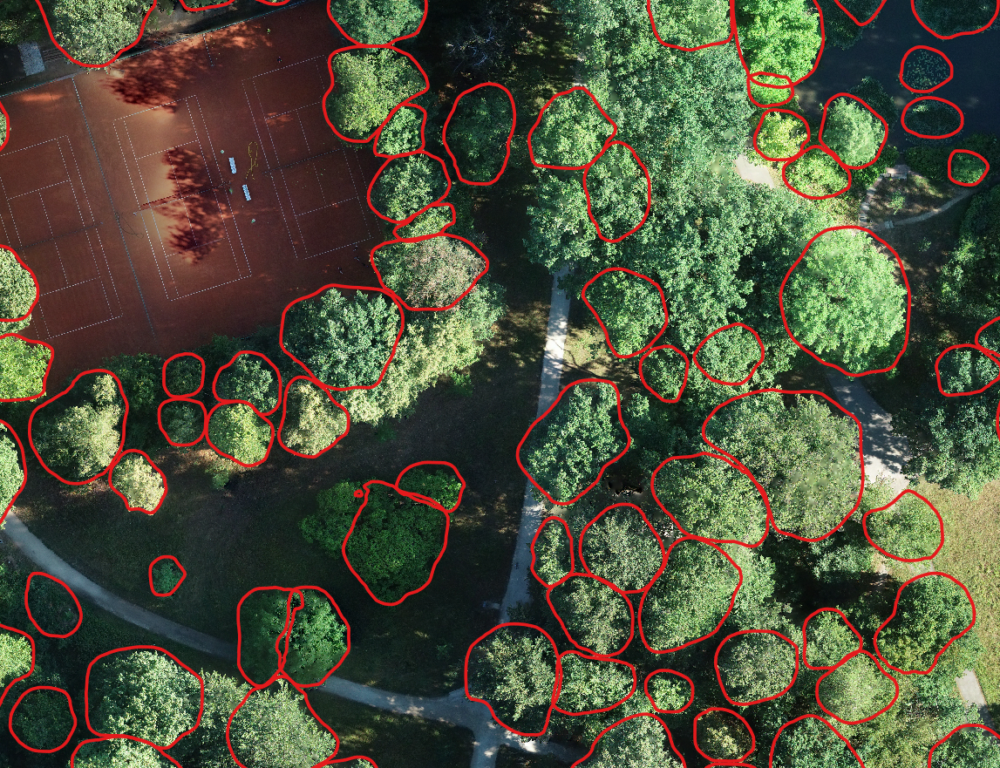

# Introduction

Due to time and content constraints, I was not able to conduct an experiment with the proposed pipeline on an unlabeled forest area during my [master's thesis](https://www.researchgate.net/publication/375121342_Unsupervised_Machine_Learning_via_Feature_Extraction_and_Clustering_to_Classify_Tree_Species_from_High-Resolution_UAV-based_RGB_Image_Data). Therefore, I will talk about this experiment in this article.


# Used data

I used raster data from the Bamberg Hain, which represents an area of about 50 ha and has a ground sampling distance of 2 cm and consists of mostly deciduous trees. 3216 detected individual trees (delineated tree crowns) were determined using a Mask R-CNN model of the [detectree2](https://github.com/PatBall1/detectree2) project.




# Data preparation steps

1. Obtain single tree crown images with the predicted tree crowns (polygons)
2. Apply CLAHE as an image enhancement method
3. Extract the image features of the individual tree crown images

I can provide the notebook and data of these three steps if anyone is interested. Just contact me.

# Clustering

Clustering was performed using the image features from DenseNet201 with the ImageNet weights. Before applying the KMeans++ clustering method, two different dimensionality reduction methods were used, namely PCA and UMAP.

**PCA**

```python
pca_nw = PCA(n_components=0.95, svd_solver='full', whiten=False, random_state=42)
```
Note: Whitening was used for clustering, but not for creating the 2D visualization.


**UMAP**

```python
reducer = umap.UMAP(n_components=2, metric='cosine', random_state=379093) 
```


**KMeans++**

The same setting with about 10 classes was used for both dimensionality reduction methods.

```python
model = KMeans(n_clusters=10, init='k-means++', n_init=500, random_state=42)
```


# Interpretation

Both panoramic images show that the tree crowns, which have a darker green coloration, are relatively well separated from the rest of the trees. The rest of the trees are less easy to distinguish from each other in both dimensionality reduction methods. This shows the same problems as in the master thesis. This means that it is difficult to distinguish certain deciduous tree species on the basis of a crown image.

On a positive note, however, UMAP is able to filter out or cluster outliers from the data set - for example predictions that were incorrectly classified as tree crowns. This can be seen in the left part of the UMAP panorama.